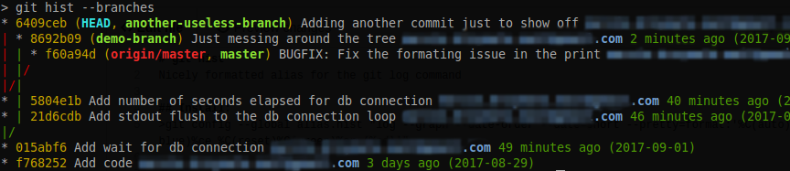

# git-hist
Nicely formatted alias for the git log command

## Benefits:
- Looks like `--decorate` with separate colors for branch names
- Adds committer email
- Adds commit relative and absolute date
- Sorts commits by date

## Install:
>git config --global alias.hist "log --graph --date-order --date=short --pretty=format:'%C(auto)%h%d %C(reset)%s %C(bold blue)%ce %C(reset)%C(green)%cr (%cd)'"

## Usage:
| Command | Description |
|---------|-------------|
| `git hist` | Show the history of current branch |
| `git hist --all` | Show the graph of all branches (including remotes) |
| `git hist master devel` | Show the relationship between two or more branches |
| `git hist --branches` | Show all local branches |

Add `--topo-order` to sort commits topologically, instead of by date (default in this alias)

## Screenshot:

